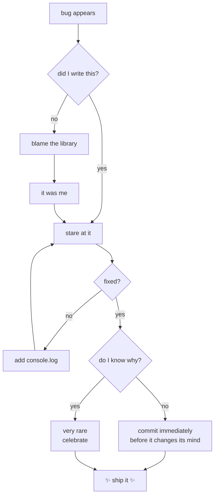
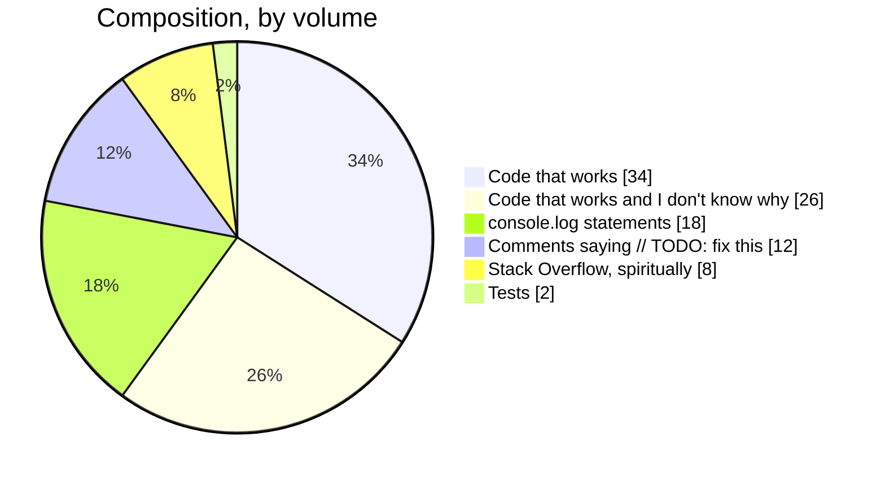

<div align="center">


<br/>

**⬇️ this README is clickable. go on, poke it.**

</div>

---

## 🎭 Pick your path

<details>
<summary><b>👔 &nbsp;I'm a recruiter</b> — <sub>click me, I'll behave</sub></summary>

<br/>

Hello! Here's the professional version:

| | |
|---|---|
| **Focus** | Computer graphics, image processing, front-end engineering |
| **Stack** | JavaScript, p5.js, Python, React, Node |
| **Recent** | Real-time optical flow, motion estimation, panorama stitching, background removal — all hand-rolled, no CV library shortcuts |
| **Looking for** | Internships & junior roles where I get to build visual things |
| **Superpower** | I read documentation. All of it. Voluntarily. |

I write code that other people can read six months later. This is, apparently, rare.

</details>

<details>
<summary><b>🧑‍💻 &nbsp;I'm a fellow dev</b> — <sub>let's talk shop</sub></summary>

<br/>

```js
const rana = {
  pronouns: "she/her",           // ← edit or delete
  editor: "VS Code + too many extensions",
  theme: "dark, obviously",
  tabsOrSpaces: "spaces, and I will not be debating this",
  hotTake: "if your function needs a comment to explain WHAT it does, rename it",
  currentlyBreaking: ["optical flow", "panorama seams", "my own build pipeline"],
  debugMethod: "console.log('here')  →  console.log('HERE')  →  console.log('!!!!!')",
  status: () => Math.random() > 0.5 ? "shipping ✨" : "refactoring the same 3 lines 🔁"
};
```

<details>
<summary><i>…there's another one in here</i></summary>

<br/>

🪆 You found the nested easter egg. Genuinely, well done — most people don't click twice.

Have a fact: the first computer bug was an actual moth. Grace Hopper taped it into the logbook in 1947. It's still there, in the Smithsonian.

</details>

</details>

<details>
<summary><b>🎲 &nbsp;I clicked this by accident</b> — <sub>stay anyway</sub></summary>

<br/>

Welcome! You are now legally obligated to look at this diagram of my debugging process:



</details>

---

## 🧪 Currently

```text
  optical flow & motion estimation   [████████████████░░░░]  80%
  panorama stitching                 [██████████░░░░░░░░░░]  50%
  learning to name variables well    [███░░░░░░░░░░░░░░░░░]  15%
  sleep schedule recovery            [█░░░░░░░░░░░░░░░░░░░]   5%
  caffeine                           [████████████████████] 100%  ⚠️ overflow
```

<div align="center">

> *"I don't always test my code, but when I do, I do it in production."*
> — me, right before the incident

</div>

---

## 🛠️ Toolbox

<div align="center">


<br/><br/>

<sub>and a p5.js sketch folder I refuse to clean up</sub>

</div>

---

## 📼 Changelog — Rana, the software

<details>
<summary><b>v3.0.0</b> &nbsp;·&nbsp; <sub>current release</sub></summary>

<br/>

**Added**
- Ability to read a stack trace without crying
- Support for writing tests *before* the bug happens (experimental, unstable)
- Dark mode for everything, including personality

**Changed**
- Migrated from "it works, don't touch it" to "it works, and here's why"
- Variable naming improved from `data2Final` → `normalizedFrameBuffer`

**Fixed**
- Off-by-one error in sleep schedule (still occasionally regresses)

</details>

<details>
<summary><b>v2.0.0</b> &nbsp;·&nbsp; <sub>the university years</sub></summary>

<br/>

**Added**
- Computer graphics module — turns out I love making pixels move
- A dangerous confidence around `for` loops

**Deprecated**
- Copy-pasting from Stack Overflow without reading the comments
- The phrase "I'll refactor it later"

**Known issues**
- Scope creep. Every project. Every time. No fix planned.

</details>

<details>
<summary><b>v1.0.0</b> &nbsp;·&nbsp; <sub>initial commit</sub></summary>

<br/>

**Added**
- `Hello, World!`
- An unreasonable emotional attachment to that first working program

**Notes**
- No version control. I know. I've grown.

</details>

---

## ❓ FAQ

<details>
<summary><b>What are you actually good at?</b></summary>
<br/>
Breaking a scary problem into ten small boring ones, then doing the boring ones. That's most of engineering, honestly.
</details>

<details>
<summary><b>Favourite bug you've ever fixed?</b></summary>
<br/>
An image kept rendering upside-down. Three hours. Two coordinate systems, one of them measuring Y from the bottom. I now check axis conventions <i>first</i>, like a person who has suffered.
</details>

<details>
<summary><b>Are you going to keep the code comments in?</b></summary>
<br/>
Yes. Future me is a stranger and deserves kindness.
</details>

<details>
<summary><b>Will you fix my bug if I ask nicely?</b></summary>
<br/>
Ask nicely <i>and</i> include a reproduction. Then absolutely.
</details>

---

## 🚀 Things I've built

<table>
<tr>
<td width="50%" valign="top">

### 🌀 Optical Flow Playground
Real-time motion estimation in the browser. Tracks how every pixel moves between frames and draws the vector field over your webcam feed.

`p5.js` `JavaScript` `Computer Vision`

**No CV library.** Every convolution written by hand, because that was the point.

</td>
<td width="50%" valign="top">

### 🏞️ Panorama Stitcher
Feeds it overlapping photos, gets back one wide shot. Feature matching, homography, blending — the whole pipeline.

`p5.js` `Image Processing`

**Status:** seams are *mostly* invisible. I'm choosing to call that art.

</td>
</tr>
<tr>
<td width="50%" valign="top">

### ✂️ Background Remover
Isolates a subject from its background using colour-space thresholding and edge refinement. Surprisingly effective. Occasionally removes an arm.

`JavaScript` `Image Ops`

</td>
<td width="50%" valign="top">

### 🎠 Interactive Carousel
A gallery that actually feels good to use — momentum scrolling, snap points, and easing curves I spent far too long tuning.

`JavaScript` `UI`

**Regret level:** zero. Animation is worth the time.

</td>
</tr>
</table>

<div align="center">
<sub>↑ swap these for your real repos — <code>### 🌀 <a href="LINK">Title</a></code> makes them clickable</sub>
</div>

---

## 🥧 What my codebase is actually made of



<div align="center">
<sub><i>The tests slice is small but it is <b>mighty</b>. (It is not mighty.)</i></sub>
</div>

---

<div align="center">

## 🤝 Say hi

<a href="mailto:itsranasalah@gmail.com"></a>
<a href="https://www.linkedin.com/in/ranasalaheldeen/"></a>
<a href="https://github.com/YOUR_USERNAME?tab=repositories"></a>

<br/><br/>


<br/><br/>

<sub><i>You scrolled all the way down. Here, have a semicolon on the house:</i></sub>
<br/>
<code>;</code>


</div>
